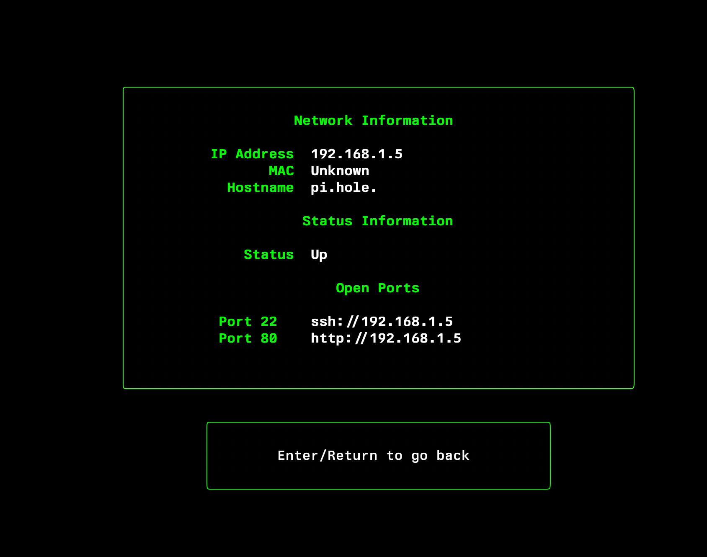

<p align="center">
<table align="center">
  <tr>
    <td align="center" width="50%"><strong>Terminal Interface</strong></td>
    <td align="center" width="50%"><strong>Web Interface</strong></td>
  </tr>
  <tr>
    <td align="center"></td>
    <td align="center"></td>
  </tr>
</table>

<div align="center">
  <h1>NetVentory</h1>
  <p><strong>Network Discovery Tool</strong></p>
  <p>🚀 Single binary | 🌍 Multiplatform | ⚡ Fast | 🎨 Beautiful | 🌐 Web | 📺 TUI</p>
  <p>
    
    
    
    
  </p>
</div>

NetVentory is a fast, beautiful network discovery tool with both terminal and web interfaces. It provides detailed device information, port scanning, and real-time monitoring without requiring root privileges.

NetVentory is a powerful yet intuitive network discovery tool that provides comprehensive visibility into your network infrastructure. With its user-friendly interfaces and robust feature set, it makes network exploration and monitoring accessible to both novice users and experienced administrators.

## 🌟 Features

### Discovery
- Fast network scanning with configurable worker count
- Automatic interface detection and CIDR range calculation
- MAC address resolution and vendor lookup
- Port scanning (22, 80, 443, 445, 139, 135, 8080, 3389, 5900)
- Hostname resolution via DNS
- No root privileges required

### Terminal Interface
- Beautiful animated UI with real-time updates
- Network interface selection with auto-detection
- Live scanning progress and worker monitoring
- Detailed device information view
- Interactive device list with navigation
- Debug mode for detailed logging

### Web Interface
- Secure access with token authentication
- Dark-themed responsive design
- Real-time updates via WebSocket
- Network interface selection
- CIDR range configuration
- Live scanning progress
- Sortable device list
- Detailed device views
- Export functionality
- Worker monitoring

### Security & Privacy
- Token-based authentication for web access
- No sensitive data collection
- Privacy-focused design

### Performance
- Concurrent scanning with worker pools
- Non-blocking operations
- Memory-efficient device tracking
- Real-time progress updates
- Cross-platform support

## ⚡ Installation

The binary is available for Windows, Mac, and Linux. You can download from the bins folder, or use the install scripts. They are in the repo if you want to browse the commands (super simple download and copy).

### 🐧 Mac & Linux

Open a terminal and run the following command:

```bash
curl -L https://raw.githubusercontent.com/RamboRogers/netventory/refs/heads/master/install.sh | sh
```

or Brew for Mac

```bash
brew tap ramborogers/netventory
brew install netventory
```

### 🪟 Windows PowerShell

Open a PowerShell terminal and run the following command:
```powershell
iwr -useb https://raw.githubusercontent.com/RamboRogers/netventory/refs/heads/master/install.ps1 | iex
```


## 🚀 Usage

NetVentory offers several command-line options:

```bash
# Standard Terminal Usage
netventory              # Start with terminal interface
netventory -d          # Enable debug mode (generates debug.log)
netventory --debug     # Same as -d

# Web Interface
netventory -w          # Start web interface
netventory --web       # Same as -w
netventory -p 8080    # Set web interface port (default: 7331)
netventory --port 8080 # Same as -p

# Performance
netventory --workers 100 # Set number of scanning workers (default: 50)

# Information
netventory -v          # Display version information
netventory --version   # Same as -v
netventory -h          # Show help message
```

When using the web interface (-w), access it at:
```
http://localhost:7331?auth=<token>
```
The authentication token is generated and displayed when starting the web interface.

## 💡 Use Cases
- **Network Auditing**: Quick network device discovery
- **Security Assessment**: Port and service enumeration
- **Network Management**: Device inventory and tracking
- **Troubleshooting**: Network connectivity verification

### Screenshots TUI GUI


<div align="center">
  <table>
    <tr>
      <td></td>
      <td></td>
    </tr>
    <tr>
      <td></td>
      <td></td>
    </tr>
  </table>
</div>

### Screenshots Web GUI

<div align="center">
  <table>
    <tr>
      <td></td>
      <td></td>
    </tr>
    <tr>
      <td></td>
      <td></td>
    </tr>
  </table>
</div>


<div align="center">

## ⚖️ License

<p>
NetVentory is licensed under the GNU General Public License v3.0 (GPLv3).<br>
<em>Free Software</em>
</p>

[](https://www.gnu.org/licenses/gpl-3.0)

### Connect With Me 🤝

[](https://github.com/RamboRogers)
[](https://x.com/rogerscissp)
[](https://matthewrogers.org)


</div>

## 🚀 What's New in v0.2.0n

### Complete Web Interface
- Beautiful dark-themed responsive UI
- Real-time scanning updates via WebSocket
- Secure authentication with unique tokens
- Network interface auto-detection
- CIDR range configuration and validation
- Live progress tracking and worker monitoring
- Sortable device list with detailed views
- Export functionality for scan results
- Access via `http://localhost:7331?auth=<token>`

### Performance Improvements
- Enhanced concurrent scanning
- Improved memory efficiency
- Better cross-platform support
- Real-time progress updates
- Optimized worker management